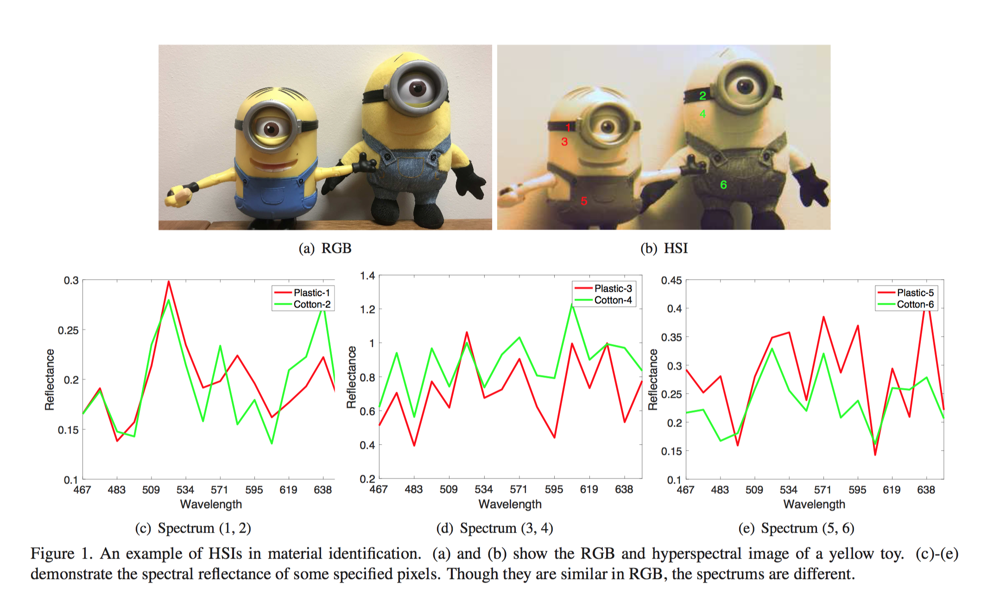
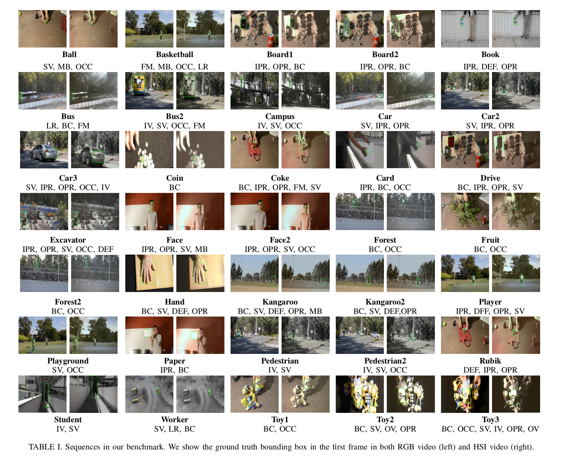

## About HSI

Hyperspectral imagery (HSI) records continuous spectrum information for each object pixel instead of a monochrome or color intensities.  These spectrum information gives very detailed information about  the material constitution of the imaged object and increases the inter-subject discrimination. Follwing figure shows an example of HSIs in material identification.  As can be seen, though it is black in pixel 1 and pixel 2, their spectral reflectances are different especially from 571nm to 638nm. 

## MHT Benchmark
Material based Hyperspectral Tracking (MHT) aims to utilize hyperspectral imagery (HSI) to boost visual object tracking. This is the first large scale hyperspectral tracking dataset including 35 color sequences and 35 hyperspectral sequence. We carefully collect videos to include multiple target categories, diverse scenarios, rich activities  and diverse content, etc.,to guarantee the generality and complexity of dataset. We believe this  benchmark can not only complement the lack of  investigating HSIs for object tracking but also drive the potential usability  of  HSIs in other computer vision problems, for example semantic segmentation and object detection. 

For each video in the dataset, we label the ground-truth by proving the bounding box annotation in the form of `[x, y, width, height]`. Each video is also labeled with the challenging factors according to 11 attributes listed in [OTB](http://cvlab.hanyang.ac.kr/tracker_benchmark/datasets.html), including  illumination variation (IV), scale variation (SV), occlusion (OCC), deformation (DEF), motion blur (MB), fast motion (FM), 	in-plane rotation (IPR), out-of-plane rotation  (OPR), out-of-view, (OV), background clutters (BC), low resolution (LR).  An  overvirew of the dataset is shown as below. The full dataset can be downloaded via [Googledrive](http://www.xiongfuli.com/cv.pdf) or [Baidu Yunpan](https://pan.baidu.com/s/1rxNxbvZytAoI-I90fD79fg)(code, send me an email to get the code). 

## Evaluation
The same as OTB dataset, we conduct one-pass evaluation (OPE) to assess the performance of each tracker.  Three evaluation metrics are adopted, namely, distance precision, overlap precision and area under curve of sucess plot  to measure different tracking algorithms. The definitions of the three metrics can be seen in the paper.

## Results

## Code
## Citation
> @article{xiong2018spectral,
  title={Material Based Object Tracking in Hyperspectral Videos},
  author={Xiong, Fengchao and Zhou, Jun and Li Xi, and Qian, Kun and Qian, Yuntao},
  journal={arXiv preprint arXiv:1812.04179},
  year={2018}
}

